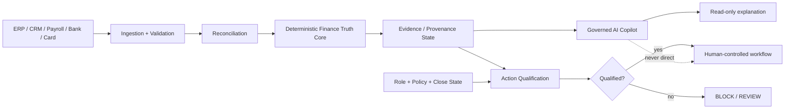

# CFO OS — Governed Finance Intelligence

> **Public portfolio build.** All company, transaction and close-cycle data in this repository is synthetic. No customer or employer data is included.

CFO OS is a full-stack finance operations demo that combines deterministic financial calculations with a deliberately constrained AI layer. The central design rule is simple:

> **The model may explain finance. It does not become financial truth, and it does not receive action authority.**

## Why this rebuild exists

Many AI finance demos collapse data, reasoning and action into a single chat interface. CFO OS separates them:

1. **Finance Truth Core** — deterministic calculations, reconciled records and dependency graphs.
2. **Trust Engine** — evidence quality, provenance, source agreement, ambiguity and unresolved-exception state.
3. **Governed Copilot** — read-only LLM analysis with sensitive-input redaction and prompt-injection detection.
4. **Action Qualification** — role + evidence + policy + close-state checks performed outside the model.
5. **Audit Layer** — append-only hash-linked public-demo events for important AI and policy decisions.

## Product surfaces

- Executive Command Center
- Data Ingestion & quality scoring
- Entity Reconciliation
- Deterministic Calculation Engine
- Governed AI Copilot
- Variance Explorer
- Audit Trail
- ROI & Impact
- Trust & Security Center

## Trust-aware AI responses

Copilot responses carry a trust envelope with:

- evidence quality,
- source agreement,
- source systems,
- unresolved exceptions,
- last verification time,
- action-authority state,
- audit identifier,
- prompt-injection risk,
- redaction count.

A model can therefore produce a fluent answer while CFO OS still says **REVIEW REQUIRED**, **MODEL ESTIMATE**, or **BLOCKED**.

## Security controls in this public build

- server-side Gemini credential only,
- no browser-side model key,
- read-only AI boundary,
- 32 KB JSON body limit,
- per-IP API rate limiting,
- basic security headers,
- strict chat payload validation,
- bounded conversation history,
- PII-pattern redaction before model calls,
- deterministic prompt-injection risk detection,
- no model-accessible tools,
- role-based action qualification,
- consequential payment execution always human-controlled,
- hash-linked audit events.

These controls are a portfolio implementation, not a claim of formal security or production certification. See [`docs/SECURITY.md`](docs/SECURITY.md).

## Architecture



## Run locally

Prerequisites: Node.js 20+

```bash
npm install
cp .env.example .env
npm run dev
```

Gemini is optional. Without `GEMINI_API_KEY`, the app runs deterministic local demo responses so the trust and product flows remain testable.

### Validate

```bash
npm run lint
npm test
npm run build
```

## Synthetic close dataset

The demo models a May 2026 close using synthetic records shaped like integrations from NetSuite, Salesforce, Gusto, Mercury and Brex. Brand names identify example source-system categories only; they do not imply affiliation.

## Research-informed design

The security rebuild was informed by current guidance around prompt injection, sensitive-information disclosure, excessive agency, human oversight and system containment, including OWASP GenAI guidance and the NIST Generative AI Profile. The implementation intentionally emphasizes **containment and deterministic authority checks**, not a claim that prompt injection can be solved by prompting.

## Disclosure boundary

The `Trust Engine` in CFO OS applies public, finance-specific principles inspired by the separate Brain AI research project: provenance, reliability, contradiction awareness, ambiguity and authority separation. It is **not** the private Brain AI resolver and contains no private research thresholds, world generators, capability-broker implementation or unreleased algorithms.

## Author

**Glenn Murray**  
Forward Deployed Engineering · AI Systems · Product Engineering
